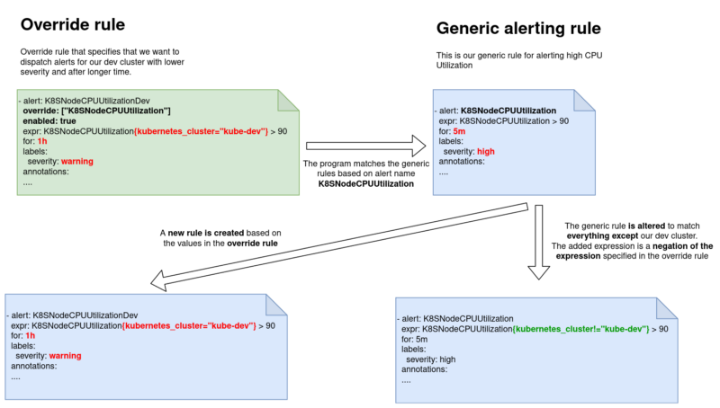

# Prometheus Alert Overrider

[](https://lablabs.io/)

| Generate a set of overridden Prometheus alerting rules based on a simple set of attributes.

Prometheus, despite how good a monitoring solution it is, does not provide a way to override alerting rules. This tool is designed to be used as a pre-processor before applying Prometheus configuration.

# The pre-processing mechanism

The program loops over all of the alerting rules until it finds an override rule. Then it finds all the matching rules we want to override and apply new filters to it. The result consists of two separate rules, the generic one with a new expression that negates the override expression and a new rule based on the overriding rule.



# Usage

The application loads all of the valid files from specified directory and applies overrides if they are defined.

For examples look at `examples` directory.

```

# Override all rules beginning with K8S
groups:
- name: k8s-workload-container-overrides
  rules:
  - alert: DisableKubeDev
    override: ["K8S.*"] # List of rules to be overriden, accepts regexp
    # If set to false, only default rules are changes and no new rules are created
    enabled: false
    # This expresion will be negated and inserted into all rules matching the values in ovveride. If enabled is set to true, use this field to define query for new rule. Only filters will be negated and inserted into default rules
    expr: '{kubernetes_cluster="kube-prod"}'
```

## Running the program

```
./prometheus_merge <path_to_rules>
```

The output is printed to stdout.

### Ansible integration

We use this tool while deployign prometheus with Ansible. You can use our ansible module from `ansible/prometheus_merge.py` and run the pre-processing on the fly.

```
#!/usr/bin/python

from ansible.module_utils.basic import *
import requests
import os
import stat

def make_executable(path):
    mode = os.stat(path).st_mode
    mode |= (mode & 0o444) >> 2    # copy R bits to X
    os.chmod(path, mode)

def main():
    fields = {
        "rules_path": {"default": True, "type": "str"},
    }

    module = AnsibleModule(argument_spec=fields)
    execPath = "/tmp/prom_merge"
    url = "https://github.com/lablabs/prometheus-alert-overrider/releases/download/v0.2.0/prometheus_merger"

    r = requests.get(url, allow_redirects=True)
    open(execPath, 'wb').write(r.content)

    make_executable(execPath)

    args = (execPath, module.params["rules_path"])

    popen = subprocess.Popen(args, stdout=subprocess.PIPE)
    popen.wait()
    output = popen.stdout.read()
    # output = popen.stderr.read()
    module.exit_json(changed=True, alerts=output)

if __name__ == '__main__':
    main()
```

## Build

```
CGO_ENABLED=0 GOOS=linux go build -o prometheus_alert_overrider main.go
```

# Limitations

Currently, the program does not allow you to override overriding rules. We also advise you to create a recording rule for more complicated expressions and use them as the alert expression. This way, the evaluation and alteration of expressions are more accurate. It will also give your alerting rules a cleaner look.

# Feature requests

If you have any suggestions or requests feel free to open an issue on Github or contact us through our website https://lablabs.io/

## License

[](https://opensource.org/licenses/Apache-2.0)

See [LICENSE](LICENSE) for full details.

    Licensed to the Apache Software Foundation (ASF) under one
    or more contributor license agreements.  See the NOTICE file
    distributed with this work for additional information
    regarding copyright ownership.  The ASF licenses this file
    to you under the Apache License, Version 2.0 (the
    "License"); you may not use this file except in compliance
    with the License.  You may obtain a copy of the License at

      https://www.apache.org/licenses/LICENSE-2.0

    Unless required by applicable law or agreed to in writing,
    software distributed under the License is distributed on an
    "AS IS" BASIS, WITHOUT WARRANTIES OR CONDITIONS OF ANY
    KIND, either express or implied.  See the License for the
    specific language governing permissions and limitations
    under the License.